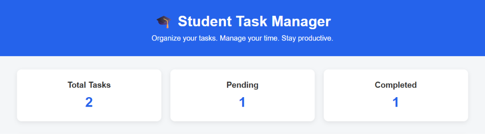
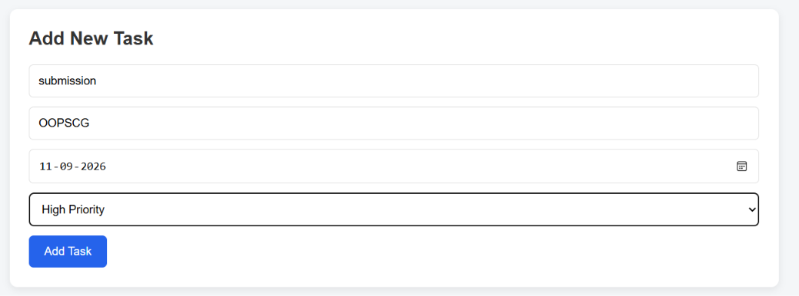
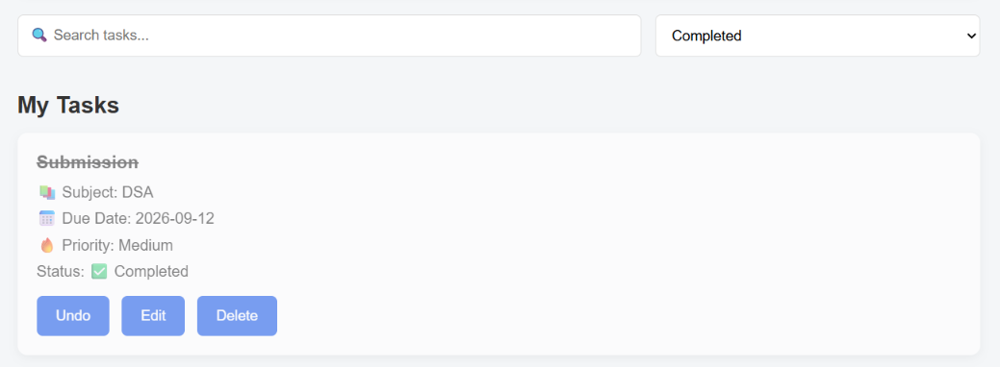

# Student Task Manager

A simple web application for students to manage their tasks and deadlines.

## ✨ Features

- ➕ Add new tasks
- ✏️ Edit tasks
- 🗑️ Delete tasks
- ✅ Mark tasks as completed
- ↩️ Undo completed tasks
- 📅 Set task due dates
- 🔥 Set task priority
- 🔍 Search tasks
- 📋 Filter tasks by status
- 📊 View total, pending and completed tasks
- 💾 Save tasks using Local Storage
- 📱 Responsive design for different screen sizes

## 🛠️ Technologies

- HTML5
- CSS3
- JavaScript
- Local Storage
- Git
- GitHub
- VS Code

## 📸 Screenshots

### Dashboard

### Add Task

### Completed Tasks

